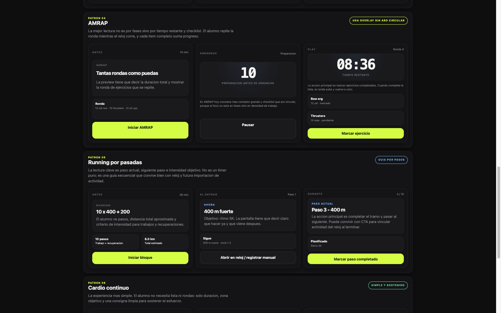
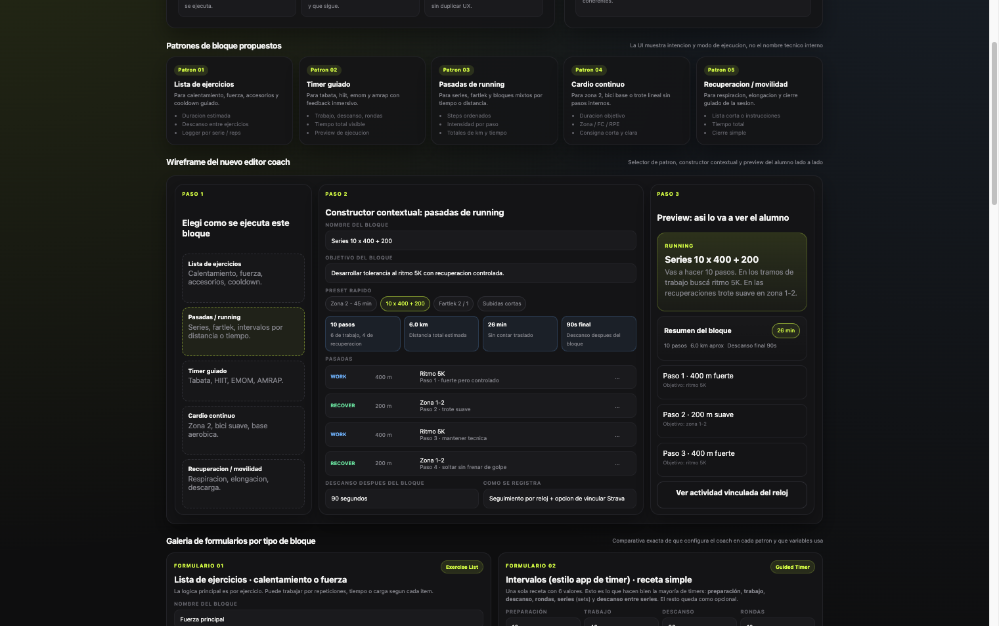

# UX Deep Audit — Conceptos, Capturas y Flujos
_Reviewed: 2026-06-12_

---

## Objetivo

Este documento baja la auditoría UX a un nivel operativo:

- separa el producto por **conceptos**
- suma **capturas iniciales**
- detecta **problemas concretos**
- propone el **flujo ideal** por caso de uso
- deja una base para iterar pantalla por pantalla

No es solo una crítica visual. Es una auditoría del **modo de uso real** del producto.

Referencias del sistema:

- [review-ux.md](file:///Users/juampi/TrainingChallengeRecomposition/docs/review-ux.md)
- [ARCHITECTURE.md](file:///Users/juampi/TrainingChallengeRecomposition/ARCHITECTURE.md)

---

## Método

La auditoría combina 3 fuentes:

- **estructura real del codebase** y rutas por rol
- **relevamiento del producto en ejecución local**
- **capturas y artefactos UX ya generados** para entrenamiento/bloques

Capturas incorporadas en esta primera pasada:

- Login actual: [ux-audit-login-current.png](file:///Users/juampi/TrainingChallengeRecomposition/docs/assets/ux-audit-login-current.png)
- Fricción auth/local actual: [ux-audit-auth-break-current.png](file:///Users/juampi/TrainingChallengeRecomposition/docs/assets/ux-audit-auth-break-current.png)
- Wireframes de builder coach: [ux-audit-workout-builder-wireframes.png](file:///Users/juampi/TrainingChallengeRecomposition/docs/assets/ux-audit-workout-builder-wireframes.png)
- Vista alumno por bloques: [ux-audit-student-views.png](file:///Users/juampi/TrainingChallengeRecomposition/docs/assets/ux-audit-student-views.png)

Capturas incorporadas en esta segunda pasada:

- Cliente semana: [ux-flow-client-week-localhost.png](file:///Users/juampi/TrainingChallengeRecomposition/docs/assets/ux-flow-client-week-localhost.png)
- Cliente detalle workout: [ux-flow-client-workout-detail.png](file:///Users/juampi/TrainingChallengeRecomposition/docs/assets/ux-flow-client-workout-detail.png)
- Cliente sesión runner: [ux-flow-client-session.png](file:///Users/juampi/TrainingChallengeRecomposition/docs/assets/ux-flow-client-session.png)
- Cliente sesión fuerza: [ux-flow-client-session-strength.png](file:///Users/juampi/TrainingChallengeRecomposition/docs/assets/ux-flow-client-session-strength.png)
- Cliente sesión completada: [ux-flow-client-completed.png](file:///Users/juampi/TrainingChallengeRecomposition/docs/assets/ux-flow-client-completed.png)
- Coach alumnos: [ux-flow-coach-students.png](file:///Users/juampi/TrainingChallengeRecomposition/docs/assets/ux-flow-coach-students.png)
- Coach detalle alumno: [ux-flow-coach-student-detail.png](file:///Users/juampi/TrainingChallengeRecomposition/docs/assets/ux-flow-coach-student-detail.png)
- Coach cambiar plan: [ux-flow-coach-change-plan-modal.png](file:///Users/juampi/TrainingChallengeRecomposition/docs/assets/ux-flow-coach-change-plan-modal.png)
- Coach mensaje alumno: [ux-flow-coach-student-detail-message.png](file:///Users/juampi/TrainingChallengeRecomposition/docs/assets/ux-flow-coach-student-detail-message.png)
- Coach workouts: [ux-flow-coach-workouts.png](file:///Users/juampi/TrainingChallengeRecomposition/docs/assets/ux-flow-coach-workouts.png)
- Coach workout builder: [ux-flow-coach-workout-builder.png](file:///Users/juampi/TrainingChallengeRecomposition/docs/assets/ux-flow-coach-workout-builder.png)
- Coach planes: [ux-flow-coach-plans.png](file:///Users/juampi/TrainingChallengeRecomposition/docs/assets/ux-flow-coach-plans.png)
- Coach editor de plan: [ux-flow-coach-plan-editor.png](file:///Users/juampi/TrainingChallengeRecomposition/docs/assets/ux-flow-coach-plan-editor.png)
- Coach vista alumno desde plan: [ux-flow-coach-plan-preview-student.png](file:///Users/juampi/TrainingChallengeRecomposition/docs/assets/ux-flow-coach-plan-preview-student.png)

---

## Hallazgo 0 — Fragilidad de Entorno / Auth

Antes de analizar features, apareció una fricción base:

- el producto depende demasiado de que `web`, `api`, `OAuth` y URLs públicas estén perfectamente alineados
- cuando eso no pasa, la app puede quedar en estados silenciosos, pantallas vacías o flujos rotos

Esto no es “solo dev”. También es UX:

- el usuario siente que “no pasa nada”
- el coach pierde confianza
- se vuelve difícil distinguir error de configuración vs error de producto

**Captura**


**Problemas**

- Estados de carga/auth demasiado silenciosos
- Falta de un estado explícito tipo `No se pudo validar sesión`
- Falta de un fallback visible para reconectar o reintentar
- El sistema “muere en blanco” con demasiada facilidad

**Mejora**

- Crear una capa transversal de estados para auth:
  - `checking-session`
  - `session-invalid`
  - `api-unreachable`
  - `oauth-misconfigured`
- Mostrar acciones concretas:
  - `Reintentar`
  - `Ir a login`
  - `Ver estado de conexión`

---

## Concepto 1 — Auth y Onboarding

Superficies clave:

- [login/page.tsx](file:///Users/juampi/TrainingChallengeRecomposition/apps/web/app/login/page.tsx)
- `registro`, `olvide-contrasenia`, `reset-password`

### Captura actual


### Qué está bien

- Visual simple y limpia
- CTA principal claro
- Acceso a Google visible
- Jerarquía básica correcta

### Problemas

- No queda claro si la app está pensada para `alumno`, `coach`, `gym` o todos a la vez
- El login no explica “qué tipo de cuenta estoy usando”
- No hay orientación contextual luego del acceso
- Cuando falla Google o el backend, el problema puede sentirse silencioso
- El sistema depende mucho de redirects y configuración técnica externa

### Riesgo UX

- Primera impresión débil
- Sensación de sistema frágil
- Dificultad para entender a qué mundo se entra después del login

### Flujo ideal

```text
Entrar -> reconocer tipo de cuenta -> iniciar sesión -> confirmar destino -> aterrizar en la home correcta
```

### Mejoras propuestas

- Agregar identificación de rol o intención:
  - `Entrar como alumno`
  - `Entrar como coach`
  - o detección posterior pero explicada
- Hacer más explícita la promesa:
  - “Tu semana de entrenamiento”
  - “Tus alumnos y planes”
- Crear estados de error más humanos:
  - `No pudimos hablar con el servidor`
  - `Tu sesión venció`
  - `Google respondió pero no pudimos cerrar el ingreso`

---

## Concepto 2 — Cliente: Semana y Sesión

Superficies clave:

- [semana/page.tsx](file:///Users/juampi/TrainingChallengeRecomposition/apps/web/app/(client)/semana/page.tsx)
- [semana/[workoutTemplateId]/page.tsx](file:///Users/juampi/TrainingChallengeRecomposition/apps/web/app/(client)/semana/%5BworkoutTemplateId%5D/page.tsx)
- [sesion/[sessionId]/page.tsx](file:///Users/juampi/TrainingChallengeRecomposition/apps/web/app/(client)/sesion/%5BsessionId%5D/page.tsx)
- [training-blocks-student-views.html](file:///Users/juampi/TrainingChallengeRecomposition/docs/training-blocks-student-views.html)

### Captura base de la experiencia alumno



### Qué debería resolver este concepto

- qué toca hacer
- qué significa cada bloque
- cuánto dura
- qué hacer ahora mismo
- cómo cerrar la sesión sin fricción

### Problemas detectados

- La experiencia “Semana” todavía compite con otras entradas del producto
- El alumno puede perder foco entre `ver`, `entender`, `iniciar`, `ejecutar`, `registrar`
- En ejecución, conviven demasiado fuerte:
  - runner
  - sets
  - swaps
  - comentarios
  - timeline
- El cierre de sesión no siempre tiene el peso emocional/operativo que debería

### Riesgo UX

- El usuario “hace pero no entiende”
- Registro interrumpe ejecución
- No siempre queda claro progreso y resultado

### Flujo ideal

```text
Semana -> CTA dominante -> Preview entendible -> Sesion en modo ejecucion -> Registro asistido -> Resumen final
```

### Mejoras propuestas

- Hacer de `Semana` la home indiscutible del alumno
- Unificar lenguaje en bloques:
  - `Preparación`
  - `Trabajo`
  - `Descanso`
  - `Siguiente`
- Separar con más claridad:
  - **modo ejecución**
  - **modo registro**
- Fortalecer pantalla de fin:
  - duración
  - bloques completados
  - highlight humano
  - CTA a feedback/mensaje

### Decisión UX clave

La sesión debe sentirse como una herramienta de **acompañamiento en tiempo real**, no como una hoja técnica editable.

---

## Concepto 3 — Coach: Constructor de Workouts y Bloques

Superficies clave:

- [workouts/page.tsx](file:///Users/juampi/TrainingChallengeRecomposition/apps/web/app/coach/workouts/page.tsx)
- [workouts/[workoutTemplateId]/page.tsx](file:///Users/juampi/TrainingChallengeRecomposition/apps/web/app/coach/workouts/%5BworkoutTemplateId%5D/page.tsx)
- [training-blocks-ux-wireframes.html](file:///Users/juampi/TrainingChallengeRecomposition/docs/training-blocks-ux-wireframes.html)

### Captura base del constructor



### Qué debería resolver este concepto

- permitir crear rápido
- permitir entender qué se está creando
- dejar clara la duración / patrón / descanso
- mostrar cómo lo verá el alumno

### Problemas detectados

- El constructor puede volverse técnico demasiado rápido
- Configurar no siempre se siente igual que “programar con confianza”
- Cuando hay muchos tipos de bloques, la carga mental explota
- Falta reforzar la distinción entre:
  - fuerza
  - intervalos
  - running
  - cardio continuo
  - recovery

### Riesgo UX

- El coach evita tipos avanzados
- Se generan bloques correctos técnicamente pero confusos para el alumno
- El sistema se siente poderoso pero difícil

### Flujo ideal

```text
Elegir patron -> Completar receta simple -> Ver duracion/resultados -> Preview alumno -> Guardar
```

### Mejoras propuestas

- Convertir todos los tipos en “constructores por patrón”
- Mantener siempre visibles:
  - patrón
  - duración estimada
  - resumen en lenguaje humano
  - preview alumno
- Evitar inputs sueltos sin contexto
- Validar que cada receta se pueda leer como una instrucción

### Decisión UX clave

El constructor no debe pedir “datos”. Debe ayudar a construir una **receta de entrenamiento entendible**.

---

## Concepto 4 — Coach: Operación de Alumnos

Superficies clave:

- [alumnos/page.tsx](file:///Users/juampi/TrainingChallengeRecomposition/apps/web/app/coach/alumnos/page.tsx)
- [alumnos/[clientUserId]/page.tsx](file:///Users/juampi/TrainingChallengeRecomposition/apps/web/app/coach/alumnos/%5BclientUserId%5D/page.tsx)

### Qué debería resolver este concepto

- saber a quién atender primero
- detectar problemas
- decidir qué hacer
- ejecutar esa acción rápido

### Problemas detectados

- Mucha información, poca jerarquía de decisión
- El detalle del alumno es rico pero puede carecer de “siguiente acción”
- Se mezclan salud, comida, sesiones, mensajes, metas y plan en una sola experiencia
- La operación diaria del coach necesita más “bandeja” y menos “dashboard genérico”

### Riesgo UX

- El coach navega mucho y decide lento
- Se pierden señales importantes
- El sistema sirve para explorar, no tanto para operar

### Flujo ideal

```text
Lista priorizada -> Detectar alerta -> Entrar al alumno -> Ver contexto -> Ejecutar accion
```

### Mejoras propuestas

- Convertir `Alumnos` en lista priorizada, no solo catálogo
- Mostrar tags accionables:
  - `no entrenó`
  - `tiene mensaje`
  - `plan vence`
  - `sesión incompleta`
- En detalle alumno, separar 3 columnas mentales:
  - señales
  - evidencia
  - acciones

---

## Concepto 5 — Planes

Superficies clave:

- [planes/page.tsx](file:///Users/juampi/TrainingChallengeRecomposition/apps/web/app/coach/planes/page.tsx)
- editores y preview relacionados en `coach/planes`

### Qué debería resolver este concepto

- diseñar estructura semanal
- asignarla a un alumno
- entender impacto inmediato en la semana real

### Problemas detectados

- El concepto “plan” puede quedar demasiado separado del uso real del alumno
- La asignación / cambio / efecto sobre semana activa no siempre se vive como una sola operación
- Falta reforzar la relación:
  - plan
  - workout
  - semana del alumno

### Mejoras propuestas

- Preview obligatorio tipo alumno
- Estado más visible de asignación y vigencia
- CTA por plan:
  - `editar`
  - `previsualizar`
  - `asignar`
  - `ver impacto`

---

## Concepto 6 — Health / Wearables

Superficies clave:

- [wearable/page.tsx](file:///Users/juampi/TrainingChallengeRecomposition/apps/web/app/(client)/cuenta/wearable/page.tsx)
- [panel/page.tsx](file:///Users/juampi/TrainingChallengeRecomposition/apps/web/app/(client)/panel/page.tsx)

### Qué debería resolver este concepto

- conectar
- confirmar que sincroniza
- entender qué datos trae
- usar esos datos para decidir

### Problemas detectados

- Conectar provider sigue siendo un proceso frágil
- Las diferencias entre “conectado”, “autorizado”, “sincronizado” y “útil” no son claras
- Cuando falla OAuth o sync, el usuario puede no entender si el problema es suyo o del sistema

### Riesgo UX

- Baja confianza
- Integraciones vistas como “experimento” y no como feature confiable

### Flujo ideal

```text
Elegir provider -> Autorizar -> Confirmar conexion -> Ver ultima sync -> Entender que se importa
```

### Mejoras propuestas

- Estados de conexión inequívocos
- Mostrar:
  - última sync
  - tipo de datos
  - si hubo error
  - qué hacer ahora
- Diseñar una vista de “salud de integración”, no solo botones OAuth

---

## Concepto 7 — Panel / Hábitos / Nutrición

Superficies clave:

- [panel/page.tsx](file:///Users/juampi/TrainingChallengeRecomposition/apps/web/app/(client)/panel/page.tsx)
- `comida`, `metas`, `mediciones`

### Qué debería resolver este concepto

- orientar el día
- reflejar adherencia
- dar contexto al entrenador

### Problemas detectados

- Puede sentirse como un segundo producto aparte del entreno
- Riesgo de densidad visual
- Mezcla demasiadas señales si no se jerarquiza `hoy`

### Mejoras propuestas

- El panel debe arrancar por:
  - `qué toca hoy`
  - `cómo venís`
  - `qué falta`
- Lo demás, debajo y colapsable
- Nutrición y hábitos deben potenciar el loop, no competir con él

---

## Concepto 8 — Mensajería y Feedback

Superficies clave:

- [coach/mensajes/page.tsx](file:///Users/juampi/TrainingChallengeRecomposition/apps/web/app/coach/mensajes/page.tsx)
- [client/mensajes/page.tsx](file:///Users/juampi/TrainingChallengeRecomposition/apps/web/app/(client)/mensajes/page.tsx)

### Qué debería resolver este concepto

- comunicar rápido
- dar seguimiento
- conectar feedback con acción

### Problemas detectados

- El chat puede quedar desacoplado del estado actual del alumno
- Falta más contexto automático:
  - última sesión
  - estado del plan
  - adherencia
- Feedback de sesión y chat podrían sentirse como dos mundos distintos

### Mejoras propuestas

- Integrar “context cards” en conversación
- Unificar mejor feedback contextual y conversación libre
- CTA desde sesión completada a comentario/mensaje

---

## Concepto 9 — Progreso

Superficies clave:

- [progreso/page.tsx](file:///Users/juampi/TrainingChallengeRecomposition/apps/web/app/(client)/progreso/page.tsx)

### Qué debería resolver este concepto

- mostrar mejora real
- motivar continuidad
- traducir datos a narrativa

### Problemas detectados

- Riesgo de ser demasiado analítico y poco accionable
- Puede sentirse separado del día a día

### Mejoras propuestas

- Mostrar menos métricas, más historia:
  - “subiste”
  - “sostuviste”
  - “venís constante”
- Vincularlo con sesiones completadas y feedback coach

---

## Concepto 10 — Notificaciones

### Qué debería resolver este concepto

- recordar
- alertar
- confirmar

### Problemas detectados

- Riesgo de exceso de tipos
- Poca jerarquía entre notificación crítica y ruido

### Mejoras propuestas

- Cliente:
  - entreno pendiente
  - mensaje coach
  - hábito pendiente
- Coach:
  - alumno inactivo
  - alumno completó
  - mensaje nuevo

---

## Concepto 11 — Social / Explorar / Desafíos

Este conjunto hoy parece más de expansión que de núcleo.

### Riesgo

- Si se prioriza demasiado pronto, puede diluir el foco del loop coach-atleta

### Recomendación

- Mantener como capa secundaria
- Diseñarlo después de que el núcleo esté sólido

---

## Concepto 12 — Gym

Superficies clave:

- [gym/page.tsx](file:///Users/juampi/TrainingChallengeRecomposition/apps/web/app/gym/page.tsx)
- [gym/clases/page.tsx](file:///Users/juampi/TrainingChallengeRecomposition/apps/web/app/gym/clases/page.tsx)

### Diagnóstico

- Tiene lógica propia
- Hoy no parece ser el principal cuello de botella UX del producto

### Recomendación

- Congelar cambios grandes hasta estabilizar:
  - cliente
  - coach
  - auth
  - wearables

---

## Resumen de Problemas Más Importantes

### Nivel 1 — Críticos

- Falta un centro de gravedad claro para cliente
- Falta un centro operativo claro para coach
- Auth/OAuth/integraciones siguen pudiendo romper la confianza del producto
- Ejecutar vs registrar no está del todo separado en la experiencia de sesión

### Nivel 2 — Altos

- Panel puede competir con training
- Constructor coach todavía puede sentirse técnico
- Operación de alumnos necesita más jerarquía
- Wearables necesitan estado y soporte mucho más claros

### Nivel 3 — Medios

- Mensajería con poco contexto
- Progreso con narrativa mejorable
- Social/Gym con prioridad menor respecto al core

---

## Roadmap UX Recomendado

```text
1. Auth / estados base / errores visibles
2. Cliente: Semana
3. Cliente: Sesion
4. Coach: Alumnos + Detalle
5. Coach: Workouts + Bloques
6. Coach: Planes
7. Wearables
8. Panel / Habitos / Nutricion
9. Mensajes / Feedback
10. Progreso / Social / Gym
```

---

## Segunda Pasada — Flujos Reales

Esta segunda pasada baja la auditoría a recorridos concretos y ya navegados en local.

No reemplaza la auditoría conceptual anterior. La aterriza.

### Flujo 1 — Cliente `Semana -> Detalle -> Sesión -> Completada`

Capturas:

- [ux-flow-client-week-localhost.png](file:///Users/juampi/TrainingChallengeRecomposition/docs/assets/ux-flow-client-week-localhost.png)
- [ux-flow-client-workout-detail.png](file:///Users/juampi/TrainingChallengeRecomposition/docs/assets/ux-flow-client-workout-detail.png)
- [ux-flow-client-session.png](file:///Users/juampi/TrainingChallengeRecomposition/docs/assets/ux-flow-client-session.png)
- [ux-flow-client-session-strength.png](file:///Users/juampi/TrainingChallengeRecomposition/docs/assets/ux-flow-client-session-strength.png)
- [ux-flow-client-completed.png](file:///Users/juampi/TrainingChallengeRecomposition/docs/assets/ux-flow-client-completed.png)

Qué confirma:

- la experiencia de ejecución ya tiene una base visual bastante mejor que el resto del producto
- el runner circular y la secuencia `prep / work / rest` marcan una dirección correcta
- el cierre de sesión existe y da sensación de progreso real

Problemas detectados:

- el salto entre `Semana` y `Detalle` todavía se siente más administrativo que motivacional
- la sesión de fuerza y la sesión de running conviven bien a nivel técnico, pero no todavía como un mismo lenguaje de producto
- la pantalla completada cierra el esfuerzo, pero no termina de devolver contexto sobre qué sigue después

To-be:

- convertir `Semana` en una home de foco, no solo en un listado
- reforzar continuidad visual entre `detalle`, `runner`, `timeline` y `cierre`
- mostrar siguiente acción clara al terminar: recuperación, feedback, próxima sesión o mensaje del coach

### Flujo 2 — Coach `Alumnos -> Detalle -> Acción`

Capturas:

- [ux-flow-coach-students.png](file:///Users/juampi/TrainingChallengeRecomposition/docs/assets/ux-flow-coach-students.png)
- [ux-flow-coach-student-detail.png](file:///Users/juampi/TrainingChallengeRecomposition/docs/assets/ux-flow-coach-student-detail.png)
- [ux-flow-coach-change-plan-modal.png](file:///Users/juampi/TrainingChallengeRecomposition/docs/assets/ux-flow-coach-change-plan-modal.png)
- [ux-flow-coach-student-detail-message.png](file:///Users/juampi/TrainingChallengeRecomposition/docs/assets/ux-flow-coach-student-detail-message.png)

Qué confirma:

- el coach ya puede recorrer el loop operativo básico sin perderse
- `detalle de alumno` funciona como hub de acciones
- cambiar plan y mandar mensaje están relativamente cerca del contexto correcto

Problemas detectados:

- la pantalla de alumnos sigue priorizando estructura sobre lectura rápida de estado
- faltan jerarquías más fuertes para distinguir `quién necesita atención hoy`
- varias acciones son funcionales, pero no componen una narrativa de seguimiento clara
- mensaje, plan, progreso y adherencia siguen viéndose como piezas separadas

To-be:

- hacer que `Alumnos` funcione como tablero de triage
- compactar en el detalle las decisiones principales del coach: intervenir, ajustar, escribir, revisar adherencia
- usar un bloque superior de resumen del alumno con riesgo, objetivo y estado actual

### Flujo 3 — Coach `Workouts / Planes -> Preview alumno`

Capturas:

- [ux-flow-coach-workouts.png](file:///Users/juampi/TrainingChallengeRecomposition/docs/assets/ux-flow-coach-workouts.png)
- [ux-flow-coach-workout-builder.png](file:///Users/juampi/TrainingChallengeRecomposition/docs/assets/ux-flow-coach-workout-builder.png)
- [ux-flow-coach-plans.png](file:///Users/juampi/TrainingChallengeRecomposition/docs/assets/ux-flow-coach-plans.png)
- [ux-flow-coach-plan-editor.png](file:///Users/juampi/TrainingChallengeRecomposition/docs/assets/ux-flow-coach-plan-editor.png)
- [ux-flow-coach-plan-preview-student.png](file:///Users/juampi/TrainingChallengeRecomposition/docs/assets/ux-flow-coach-plan-preview-student.png)

Qué confirma:

- el editor de planes está más cerca del loop real del coach porque sí conecta con `Vista alumno`
- la preview desde plan es valiosa: deja verificar semana, alumno, pendientes y completadas sin salir del contexto
- el builder de workouts tiene potencia operativa, pero todavía se siente como herramienta interna

Problemas detectados:

- inconsistencia fuerte: desde `Planes` existe `Vista alumno`, desde `Workouts` no aparece un preview equivalente
- esto rompe el modelo mental del coach porque construir un workout no permite validar enseguida cómo lo verá el alumno
- la preview del alumno depende hoy del plan, no del workout como unidad reutilizable
- `Workouts`, `Planes` y `Semana del alumno` todavía no se sienten como tres caras del mismo objeto

To-be:

- agregar un `Preview alumno` directo en `coach/workouts/[workoutTemplateId]`
- permitir alternar rápido entre `editar`, `preview coach`, `preview alumno`
- normalizar labels, duraciones y bloques para que el builder y la sesión compartan el mismo lenguaje
- usar la preview como checkpoint de calidad antes de publicar o asignar

### Cambios Concretos Priorizados

- `P0`: estados visibles de auth y recuperación de sesión para evitar pantallas vacías
- `P0`: `Preview alumno` directo desde workout builder
- `P1`: tablero de alumnos orientado a atención y prioridad, no solo a listado
- `P1`: continuidad visual más fuerte entre `Semana`, `Detalle`, `Sesión` y `Completada`
- `P1`: unificar lenguaje visual entre builder coach y experiencia alumno
- `P2`: sumar anotaciones visuales sobre capturas y wireframes objetivo para la siguiente ronda

## Próximo Paso Recomendado

Tomar esta segunda pasada y hacer una tercera iteración ya orientada a solución visual:

- marcar problemas directamente sobre las capturas
- producir wireframes `before / after` por pantalla
- definir tickets de implementación por prioridad y módulo

Documento generado para esa tercera pasada:

- [review-ux-pass3-solutions.md](file:///Users/juampi/TrainingChallengeRecomposition/docs/review-ux-pass3-solutions.md)
