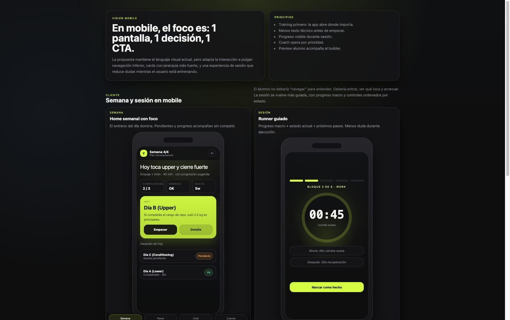

# UX Vision (Mobile) — Cómo Sería en Celular
_Reviewed: 2026-06-12_

---

## Objetivo

Mostrar la misma visión de UX pero pensada para pulgar, con navegación inferior y pantallas más “una decisión por vez”.

Mockup navegable:

- [review-ux-pass4-vision-mobile.html](file:///Users/juampi/TrainingChallengeRecomposition/docs/review-ux-pass4-vision-mobile.html)

Vista completa exportada:

- [ux-vision-mobile-full.png](file:///Users/juampi/TrainingChallengeRecomposition/docs/assets/ux-vision-mobile-full.png)

---

## Principios Mobile

- `1 pantalla = 1 decisión principal` (CTA dominante)
- navegación inferior para loops frecuentes (`Semana / Panel / Chat / Cuenta`)
- menos densidad antes de arrancar, más contexto en cards
- durante sesión: progreso macro + “qué viene después”
- en coach: señales y acciones, no tablas

---

## 1) Cliente — Semana

Por qué es mejor:

- la acción principal se vuelve obvia (Empezar)
- los pendientes se corren a un bloque secundario “Después de hoy”
- la semana cuenta progreso y “estado” sin obligar a abrir otras pantallas

---

## 2) Cliente — Sesión runner

Por qué es mejor:

- el usuario ve `bloque actual` + `progreso total` + `próximo paso`
- controles ordenados por estado (CTA dominante abajo)
- menos dudas en el momento de ejecutar

---

## 3) Coach — Alumnos (triage)

Por qué es mejor:

- en mobile una tabla no sirve: cards con señal mínima + acciones sí
- el coach ve quién requiere atención sin abrir cada alumno
- CTA inmediatos (Mensaje / Ajustar / Asignar)

---

## 4) Coach — Builder (preview)

Por qué es mejor:

- en mobile no conviene split: se usa un switch de modo `Editar / Alumno / Coach / Guardar`
- el coach valida “cómo se siente” el entreno sin salir del builder
- reduce edición a ciegas y mejora consistencia con el alumno
