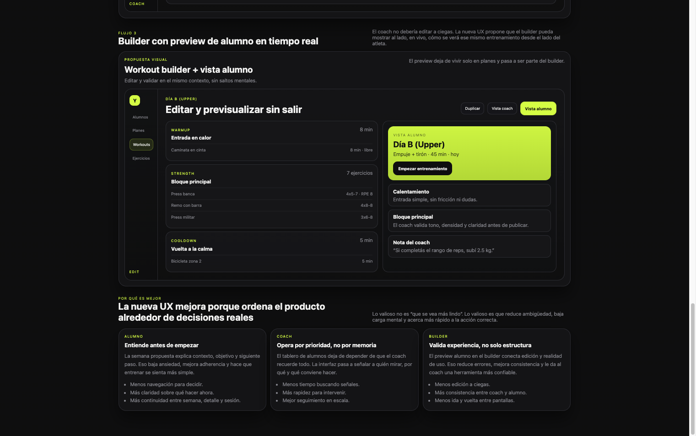

# UX Vision — Cómo Quedaría la Nueva Experiencia
_Reviewed: 2026-06-12_

---

## Objetivo

Este documento muestra una propuesta visual de hacia dónde debería ir la UX de YourCoachFit:

- cómo se vería la nueva experiencia
- qué cambia respecto de lo actual
- por qué sería mejor en uso real

Mockup navegable:

- [review-ux-pass4-vision.html](file:///Users/juampi/TrainingChallengeRecomposition/docs/review-ux-pass4-vision.html)
- Versión mobile: [review-ux-pass4-vision-mobile.html](file:///Users/juampi/TrainingChallengeRecomposition/docs/review-ux-pass4-vision-mobile.html)
- Resumen mobile: [review-ux-pass4-vision-mobile.md](file:///Users/juampi/TrainingChallengeRecomposition/docs/review-ux-pass4-vision-mobile.md)

Vista completa exportada:

- [ux-vision-pass4-full.png](file:///Users/juampi/TrainingChallengeRecomposition/docs/assets/ux-vision-pass4-full.png)

---

## Idea Central

La propuesta no intenta “ponerle maquillaje” a la UI actual.

La propuesta reorganiza el producto alrededor de su loop real:

```text
Coach programa -> Alumno entiende -> Alumno ejecuta -> Coach interpreta -> Coach ajusta
```

Hoy muchas pantallas funcionan, pero todavía se sienten demasiado administrativas o fragmentadas.

La nueva UX busca:

- más foco
- menos carga mental
- más continuidad entre pantallas
- mejores decisiones con menos fricción

---

## 1. Cliente — Semana con Foco

Propuesta visual:



### Qué cambia

- la home semanal deja de ser un listado y pasa a ser una pantalla de intención
- el entreno del día se convierte en el centro visual absoluto
- aparecen contexto, progreso, recuperación y siguiente paso en un mismo marco
- los pendientes dejan de competir con el CTA principal

### Por qué es mejor que lo actual

- hoy `Semana` ayuda a ver qué hay cargado; la propuesta ayuda a decidir qué hacer ya
- baja el tiempo entre “entro a la app” y “empiezo a entrenar”
- mejora motivación porque la sesión del día se siente importante
- le da al alumno una lectura más humana del plan, no solo una agenda técnica

### Ganancia UX

- más claridad
- más adherencia
- menos navegación

---

## 2. Cliente — Sesión Más Guiada

Propuesta visual:


### Qué cambia

- se agrega progreso macro de sesión
- el estado actual domina toda la pantalla
- el próximo paso ya está anunciado
- los controles secundarios pierden peso visual frente al CTA correcto

### Por qué es mejor que lo actual

- hoy el runner ya va en buena dirección, pero todavía muestra poco del recorrido completo
- esta versión reduce dudas durante la ejecución
- hace más obvio qué está pasando ahora y qué viene después
- convierte la sesión en una experiencia más confiable y menos “manual”

### Ganancia UX

- menos confusión en el momento de entrenar
- mejor continuidad entre bloques
- experiencia más premium y más clara

---

## 3. Coach — Alumnos Como Tablero de Atención

Propuesta visual:


### Qué cambia

- la pantalla deja de ser una tabla plana y pasa a ser un tablero operativo
- se priorizan señales reales: riesgo, adherencia, plan, mensajes, acción sugerida
- cada fila responde mejor la pregunta “qué hago con esta persona”
- los quick actions aparecen más cerca del problema real

### Por qué es mejor que lo actual

- hoy `Alumnos` sirve para navegar; esta propuesta sirve para gestionar
- reduce memoria operativa del coach
- mejora escalabilidad cuando hay muchos alumnos
- ordena la operación por prioridad y no solo por nombre

### Ganancia UX

- menos tiempo buscando
- más rapidez para intervenir
- mejor gestión diaria de cartera

---

## 4. Coach — Builder con Preview de Alumno

Propuesta visual:


### Qué cambia

- el builder deja de ser solo una herramienta de edición
- aparece `Vista alumno` como parte natural del flujo
- el coach puede validar tono, claridad y densidad del entreno sin salir del contexto
- edición y validación se integran en una sola experiencia

### Por qué es mejor que lo actual

- hoy el preview vive en `Planes`, pero no en `Workouts`
- eso obliga a editar a ciegas o a reconstruir mentalmente cómo lo verá el alumno
- esta propuesta elimina ese salto mental
- mejora consistencia entre lo que el coach arma y lo que el alumno recibe

### Ganancia UX

- menos errores de diseño de entrenos
- menos ida y vuelta entre pantallas
- más confianza antes de publicar o asignar

---

## Resumen Ejecutivo

Esta visión sería mejor que la UX actual porque cambia el eje del producto:

- de pantallas que informan a pantallas que orientan
- de navegación fragmentada a continuidad de flujo
- de herramientas separadas a un sistema más coherente entre coach y alumno

En concreto:

- el alumno entiende más rápido qué hacer
- el coach detecta más rápido dónde intervenir
- el builder deja de ser técnico solamente y pasa a ser también experiencial

---

## Próximo Paso Recomendado

Usar esta visión como base para un plan de implementación por fases:

1. `P0`: `Preview alumno` en workout builder
2. `P1`: rediseño de `Semana`
3. `P1`: tablero priorizado de `Alumnos`
4. `P1`: ajustes de jerarquía en sesión y cierre

Documentos relacionados:

- [review-ux.md](file:///Users/juampi/TrainingChallengeRecomposition/docs/review-ux.md)
- [review-ux-deep-dive.md](file:///Users/juampi/TrainingChallengeRecomposition/docs/review-ux-deep-dive.md)
- [review-ux-pass3-solutions.md](file:///Users/juampi/TrainingChallengeRecomposition/docs/review-ux-pass3-solutions.md)
